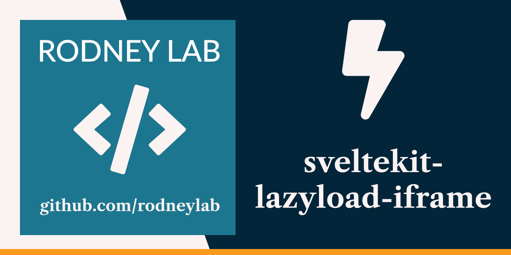

  

<h1 align="center">
  SvelteKit Lazy Load iframe
</h1>

# sveltekit-lazyload-iframe

SvelteKit demo code for responsive lazy loading iframes. See the video in the post at <a aria-label="Read Rodney Lab blog post on implementing lazy loading iframes in Svelte Kit" href="https://rodneylab.com/lazy-loading-iframes-sveltekit/">rodneylab.com/lazy-loading-iframes-sveltekit/ to see why lazy loading is important</a> and how it can improve Core Web Vitals metrics used by Google for ranking search results.

Please drop questions into a comment at the bottom of that video post pages.